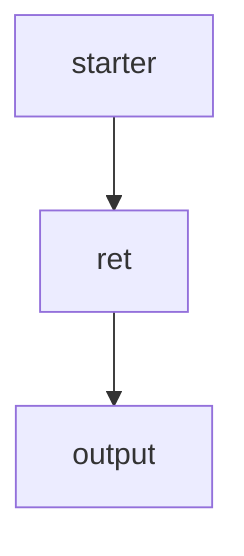

# Sample Rag flow



The sample RAG flow follows the structure shown above.  
Below is a guide on how to run it.

To enable retrieval, you need a vector database to store and retrieve context.  
We provide a sample Docker Compose setup that allows you to easily run a Milvus instance.

---

# How to Run

## 1. Start the Milvus Instance
```bash
cd config && docker compose up -d
```

## 2. Update Settings.py
the correct API_KEY.  
This API_KEY is used across the project, including by the LLM adapters.

## 3. Generate Queries

You may test with the sample file at **datas/queries/custom/queries.txt**,  
but it’s worth trying the built-in query generation feature as well.  
It's fancy!
```bash
ragang query-gen -D <Doc folder path> -Q <generated query filename>.json
```
- **Doc folder path**: Any directory containing documents.
- **Generated query filename**: The file path (including filename) where the generated queries will be stored.
For example, specify a path under datas/queries/generated/.

## 4. Run the RAG

```bash
ragang run -Q <query file path> -F <flow id> --no-save
```

- **-F**:
If omitted, all RAG flows defined in manager.py will run.
To execute only a specific RAG, provide the flow_id defined for that RAG container.
- **--no-save**:
Determines whether evaluation results are saved to history.
When included, evaluation results will not be written to history.

---

# 2026 평가·진단 워크플로

RAGANG은 평가 실패를 0점으로 바꾸지 않고 `Not evaluated`로 보존합니다. 각 실행에는
평가기 구현 지문, 공개 설정, 설정 지문, 평가 성공률과 실패 유형이 함께 저장되며,
관측 사실과 가능한 원인 추론을 분리한 진단을 제공합니다. 문서 본문, 프롬프트,
로컬 경로와 인증정보는 provenance에 포함하지 않습니다.

저장된 두 실행은 다음 명령으로 비교할 수 있습니다. 실행 시각을 생략하면 해당
flow의 최근 두 실행을 사용합니다.

```bash
ragang compare -F <flow id>
ragang compare -F <flow id> --baseline <timestamp> --candidate <timestamp> --json
```

외부 API나 벡터 데이터베이스 없이 실제 문서 검색·생성·평가·대시보드 흐름을
재현하려면 [DEMO.md](DEMO.md)를 따르세요.

배포 wheel을 바이트 단위로 재현해야 할 때는 소스 커밋 시각을 고정합니다.

```bash
SOURCE_DATE_EPOCH=$(git log -1 --pretty=%ct) uv build --wheel
```
