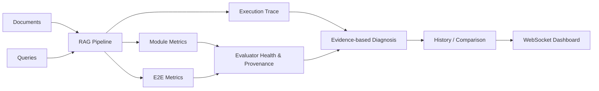

# RAGANG

**Ground-truth-free RAG Evaluation and Diagnosis Framework**

RAGANG은 정답 데이터셋이 없어도 RAG 실행을 단계별로 평가하고, 평가 자체의 실패와
파이프라인의 이상 징후를 구분해 다음 실험을 설계할 수 있도록 돕는 Python
framework입니다. Gold/reference 기반 metric은 선택적으로 사용할 수 있지만 핵심
실행·평가·진단 흐름에는 필요하지 않습니다.

## 해결하려는 문제

RAG 품질은 최종 답변 점수 하나로 설명되지 않습니다. Retrieval이 비었는지,
generator가 검색 근거를 사용했는지, judge가 정상 응답했는지, 순환형 workflow가
어느 단계에서 반복 또는 실패했는지를 함께 보아야 합니다. 또한 서로 다른 단위와
방향의 metric을 한 숫자로 평균하면 실제 문제를 숨길 수 있습니다.

RAGANG은 다음 원칙을 지킵니다.

- 실제 0점과 평가 실패를 구분합니다. 지원되지 않는 입력과 adapter/judge 실패는
  `not evaluated`입니다.
- Runtime 관측과 가능한 원인 추론을 분리합니다. 추론에는 confidence와 다음 확인
  행동이 포함됩니다.
- Metric 구현·입력 source·안전한 공개 설정·adapter model·configuration fingerprint를
  남깁니다. Credential, prompt 원문, 문서 본문, 로컬 경로는 provenance에 넣지 않습니다.
- Metric별 원래 단위와 방향을 유지합니다. 이질적인 metric의 단일 종합점수를 만들지
  않습니다.

## 주요 기능

- Linear, branch, conditional, merge, retry/cycle pipeline 실행
- Module 및 end-to-end metric과 명시적 evaluator health
- 실행별 `execution_id`, parent 관계, 반복 횟수, 실제 다음 node, latency, 실패 trace
- 비수렴 cycle을 제한하는 `max_steps`
- 관측/추론 분리 진단과 실패 ancestry path
- Configuration-aware baseline/candidate 비교와 coverage·범위·표준편차
- Gold-free distractor/conflict/noisy-context injection, dropout, shuffle perturbation
- History와 실제 WebSocket payload를 사용하는 React dashboard
- 외부 서비스 없는 offline demo와 Milvus/Ollama live demo

## 시스템 구조



`FlowEngine`은 module graph를 실행하고 `State`에 `Packet`, `Performance`, trace를
저장합니다. GraphRAG retriever도 하나의 module로 계측할 수 있지만, RAGANG 자체가
knowledge graph를 구축하거나 GraphRAG retrieval algorithm을 제공하는 것은 아닙니다.

## 설치

Python 3.13 이상이 필요합니다.

```bash
python3.13 -m venv .venv
.venv/bin/pip install -e .
.venv/bin/ragang --help
```

새 프로젝트를 만들려면 다음을 실행합니다.

```bash
.venv/bin/ragang init my-rag-project
cd my-rag-project
```

생성된 `manager.py`에서 module, metric, adapter, `RAGContainer`를 구성합니다. API key는
source에 쓰지 말고 환경변수로 전달합니다.

## 기본 workflow

### Pipeline 구성과 실행

```python
from ragang.container import RAGContainer
from ragang.core.bases.abstracts.base_engine import FlowEngine

rag = RAGContainer(
    flow_id="my_flow",
    modules=[starter, retriever, generator],
    e2e_metrics=[answer_query_similarity],
    max_steps=100,
)
engine = FlowEngine([rag])
result = engine.invoke("What does RAGANG diagnose?")
```

`Linker`로 `AND` merge와 `OR` branch/retry dependency를 구성합니다. 세부 trace schema와
cycle 제한은 [Graph/Cycle RAG 안내](docs/graph-rag/execution-trace.md)를 참고하세요.

### CLI 실행과 비교

```bash
ragang run -Q custom/queries.txt -F my_flow
ragang compare -F my_flow --json
ragang compare -F my_flow --baseline <timestamp> --candidate <timestamp>
ragang show -F my_flow
```

비교는 metric별로만 수행하며 `evaluated`, `not_evaluated`, coverage, min/max,
population standard deviation, latency, configuration fingerprint를 함께 제시합니다.

### Counterfactual retrieval probe

```python
from ragang import perturb_retrieval

variant = perturb_retrieval(
    retrieved_documents,
    kind="distractor_injection",
    injected_documents=user_labeled_distractors,
    seed=7,
)
candidate_documents = variant["documents"]
```

이 API는 재현 가능한 변형과 provenance를 만들 뿐, 주입 문서가 실제 distractor인지
검증하거나 score delta를 인과 효과로 주장하지 않습니다. 사용법과 해석 규칙은
[Counterfactual 평가](docs/evaluation/counterfactual.md)에 있습니다.

## 지원 workflow

| Workflow | 지원 범위 | 주의점 |
| --- | --- | --- |
| Linear RAG | Retrieval → generation → E2E 평가 | 각 module의 declared input/output 필요 |
| Branch / merge | Conditional `next`, `AND`/`OR` dependency | Merge parent가 여러 개일 수 있음 |
| Self-corrective / retry | Module revisit와 cycle trace | `max_steps` 안에 answer로 수렴해야 함 |
| Agentic RAG | Tool/decision step을 custom module로 표현 | 내부 agent thought가 아닌 명시적 module event만 관측 |
| GraphRAG | Graph retriever를 module로 계측 | KG 구축 품질은 별도 입력/metric이 필요 |
| Offline evaluation | Deterministic adapter와 local documents | Demo 점수는 benchmark 주장이 아님 |
| Live evaluation | Milvus/Ollama 또는 사용자 adapter | 외부 model/service 품질과 가용성에 의존 |

## 연구적 위치와 한계

RAGANG의 강점은 gold-free 실행 가능성과 **WHY-oriented diagnosis**입니다. Reference-free
judge는 정답 oracle이 아니므로 evaluator coverage와 provenance를 score보다 먼저
확인해야 합니다. 최종 답변만 보는 평가는 agentic/iterative pipeline의 중간 실패를
놓칠 수 있어 trace를 함께 제공합니다. Noise/conflict probe 역시 robustness sensitivity를
보는 도구이지 인과 추론이나 실제 정확도의 증명이 아닙니다.

현재 한계는 다음과 같습니다.

- 기본 engine은 query별 answer 하나를 생성하므로 다중 generation consistency metric은
  별도 반복 실행 집계 없이는 `not evaluated`입니다.
- LLM judge 결과는 model/prompt와 calibration에 민감합니다.
- GraphRAG knowledge graph의 entity/triple/community 품질을 RAGANG이 자동 검증하지 않습니다.
- Metric별 방향과 단위가 다르므로 전역 순위나 단일 종합점수를 제공하지 않습니다.
- 실패한 query의 State는 container와 WebSocket history에 보존되지만, 실패한 direct
  `invoke` 반환값에는 query ID가 없습니다.

연구 근거와 채택/보류 결정은 [2026 연구 정렬](docs/evaluation/research-alignment.md), 전체
평가 계약은 [EVALUATION.md](EVALUATION.md), 내장 metric은
[metric catalog](docs/metrics/catalog.md)를 참고하세요.

## Demo

외부 API나 vector database 없이 전체 workflow를 확인하려면 offline demo를 사용합니다.

```bash
cd examples/local_demo
RAGANG_DEMO_MODE=noisy ../../.venv/bin/ragang run -F local_demo -Q custom/demo.txt
RAGANG_DEMO_MODE=focused ../../.venv/bin/ragang run -F local_demo -Q custom/demo.txt
../../.venv/bin/ragang compare -F local_demo --json
../../.venv/bin/ragang show -F local_demo
```

Milvus와 Ollama를 사용하는 live demo, service health check, 정리 절차는
[DEMO.md](DEMO.md)에 있습니다. 두 demo의 점수 모두 연구 benchmark로 해석하면 안 됩니다.

## 개발과 검증

```bash
.venv/bin/python -m unittest discover -s tests -v
.venv/bin/python -m compileall -q ragang tests
```

Frontend source repository에서는 다음을 실행합니다.

```bash
npm ci
npm test
npm run typecheck
npm run build
```

구조와 기여 규칙은 [DEVELOPMENT.md](DEVELOPMENT.md), release 및 frontend bundle 절차는
[RELEASE.md](RELEASE.md), 유지보수 agent 규칙은 [AGENTS.md](AGENTS.md)에 있습니다.
