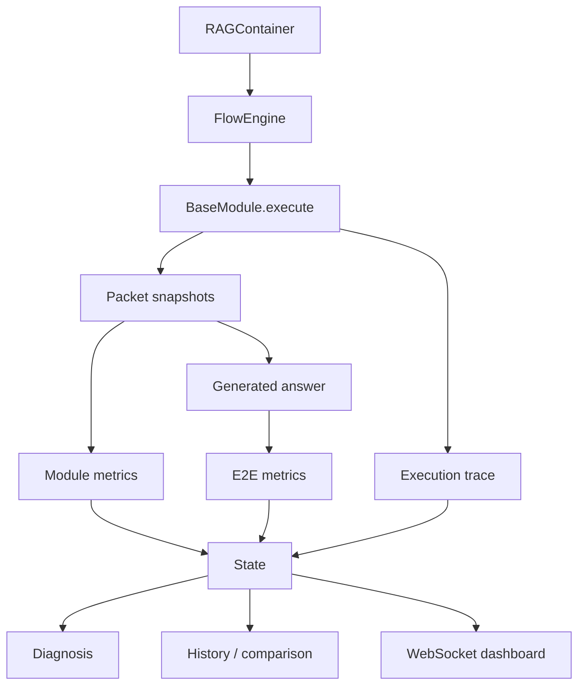

# Architecture overview

## Core

- `BaseContainer`: flow ID, module graph, E2E metric, `max_steps`, state storage
- `FlowEngine`: dependency scheduling, output validation, metric isolation, trace, diagnosis
- `BaseModule`: typed-by-convention `execute(**params)` contract and `Linker` dependency
- `BaseMetric`: ordered `param_refs`와 `Performance` 반환 계약
- `State`: query, snapshots, answer, E2E performance, provenance, diagnosis, execution trace
- `Packet`: 한 module 실행의 output, 다음 module별 formed output, metric, latency

Scheduler queue는 module, formed parameters, parent execution IDs를 보존합니다. `AND`
dependency는 준비된 모든 predecessor snapshot을, `OR` dependency는 실행 상태가 유효한
predecessor snapshot을 사용합니다. 따라서 merge/retry event는 parent가 여러 개일 수
있습니다.

## Serialization과 network

State는 CLI history와 WebSocket dashboard가 공유하는 단일 데이터 계약입니다. Public
field와 과거 private-mangled `Performance` field를 frontend normalizer가 모두 읽습니다.
Strict JSON에서 사용할 수 없는 NaN/Inf는 `null`로 직렬화되며, evaluator validation이
이를 미평가로 일관되게 만듭니다.

## Adapter 경계

LLM, embedding, Milvus는 adapter 뒤에 있습니다. Normal regression은 fake adapter를
사용하고, 외부 service 검증은 live demo/integration 단계에서만 수행합니다. Provenance에는
adapter 구현과 공개 model 이름만 남기며 content/credential은 제외합니다.

## Frontend 경계

`RAG-APP-UI`가 source of truth이고 `ragang/web/`은 production artifact입니다. Dashboard는
모든 module repetition, evaluator health, raw unit, observation/inference, graph trace를
표시합니다. Metric scale을 자동 percent로 변환하거나 이질 score를 평균하지 않습니다.
