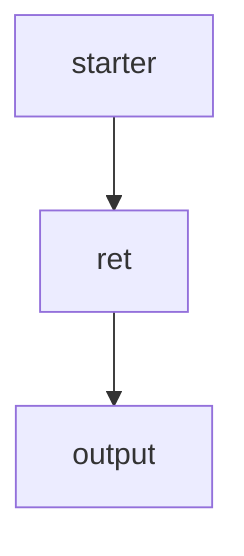

# Sample Rag flow



The sample RAG flow follows the structure shown above.  
Below is a guide on how to run it.

To enable retrieval, you need a vector database to store and retrieve context.  
We provide a sample Docker Compose setup that allows you to easily run a Milvus instance.

---

# How to Run

## 1. Start the Milvus Instance
```bash
cd config && docker compose up -d
```

## 2. Update Settings.py
the correct API_KEY.  
This API_KEY is used across the project, including by the LLM adapters.

## 3. Generate Queries

You may test with the sample file at **datas/queries/custom/queries.txt**,  
but it’s worth trying the built-in query generation feature as well.  
It's fancy!
```bash
ragang query-gen -D <Doc folder path> -F <generated query filename>.json
```
- **Doc folder path**: Any directory containing documents.
- **Generated query filename**: The file path (including filename) where the generated queries will be stored.
For example, specify a path under datas/queries/generated/.

## 4. Run the RAG

```bash
ragang run -Q <query file path> -F <flow id> --no-save
```

- **-F**:
If omitted, all RAG flows defined in manager.py will run.
To execute only a specific RAG, provide the flow_id defined for that RAG container.
- **--no-save**:
Determines whether evaluation results are saved to history.
When included, evaluation results will not be written to history.
